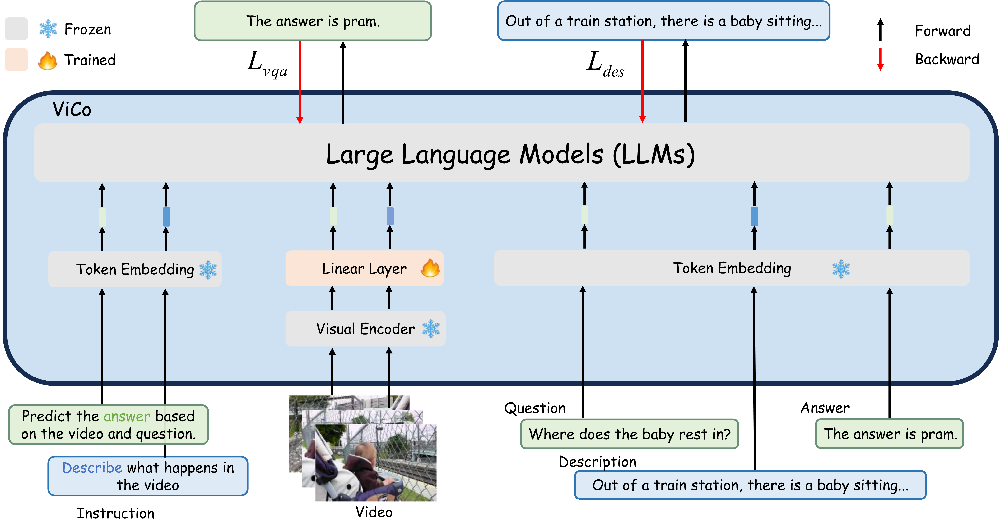

# ViCo: A Multitask Video-enhanced and Cognition-preserving Modality Alignment Trainging Framework

This is the official implementation of ViCo.

<div align="center">
  
</div>

## Setup
To install requirements, run:
```
mkdir pretrained
mkdir data
conda create -n vico python=3.8
conda activate vico
bash setup.sh
```

## Dataset & LLaMA Preparation

You can download our preprocessed datasets (NExT-QA, STAR, TVQA and IntentQA) at [here](https://drive.google.com/drive/folders/1zGFJ41qjYULQE3D7AA6LtpaKAKl71qD_?usp=sharing). Put them in ```./data```. Also, you can download original LLaMA at [here](https://github.com/facebookresearch/llama/tree/llama_v1), and put the checkpoint in ```./pretrained```.

```
./pretrained
   └─ llama
       |─ 7B
       |   |─ consolidated.00.pth
       |   └─ params.json
       └─ tokenizer.model
./data
   |─ nextqa
   |   |─ train.csv
   |   |─ val.csv
   |   └─ clipvitl14.pth
   |─ star
   |   :
   |─ tvqa
   |   :
   └─ intentqa
       :
```

## Training ViCo

### NExT-QA

```
torchrun --rdzv_endpoint 127.0.0.1:1234 --nproc_per_node 8 train.py --model 7B \
--max_seq_len 160 --max_cap_len 384 --batch_size 8 --epochs 10 --warmup_epochs 2 --bias 3.5 --tau 100. --max_feats 10 --dataset nextqa \
--blr 9e-2 --weight_decay 0.14 --output_dir ./checkpoint/nextqa --accum_iter 2 --cap 0.5
```

### STAR

```
torchrun --rdzv_endpoint 127.0.0.1:1234 --nproc_per_node 8 train.py --model 7B \
--max_seq_len 160 --max_cap_len 384 --batch_size 8 --epochs 10 --warmup_epochs 2 --bias 3.5 --tau 100. --max_feats 10 --dataset star \
--blr 9e-2 --weight_decay 0.14 --output_dir ./checkpoint/star --accum_iter 2 --cap 0.5
```

### TVQA

```
torchrun --rdzv_endpoint 127.0.0.1:1234 --nproc_per_node 8 train.py --model 7B \
--max_seq_len 160 --max_cap_len 384 --batch_size 8 --epochs 10 --warmup_epochs 2 --bias 3.5 --tau 100. --max_feats 10 --dataset tvqa \
--blr 9e-2 --weight_decay 0.14 --output_dir ./checkpoint/tvqa --accum_iter 2 --cap 0.5
```

### IntentQA

```
torchrun --rdzv_endpoint 127.0.0.1:1234 --nproc_per_node 8 train.py --model 7B \
--max_seq_len 160 --max_cap_len 384 --batch_size 8 --epochs 10 --warmup_epochs 2 --bias 3.5 --tau 100. --max_feats 10 --dataset intentqa \
--blr 9e-2 --weight_decay 0.14 --output_dir ./checkpoint/intentqa --accum_iter 2 --cap 0.5
```

We provide checkpoints and captions [here](https://huggingface.co/AInsabsw/ViCo).

## Evaluation
From the training command, simply add ```--resume ./your/checkpoint.pth``` and ```--init_eval```.
